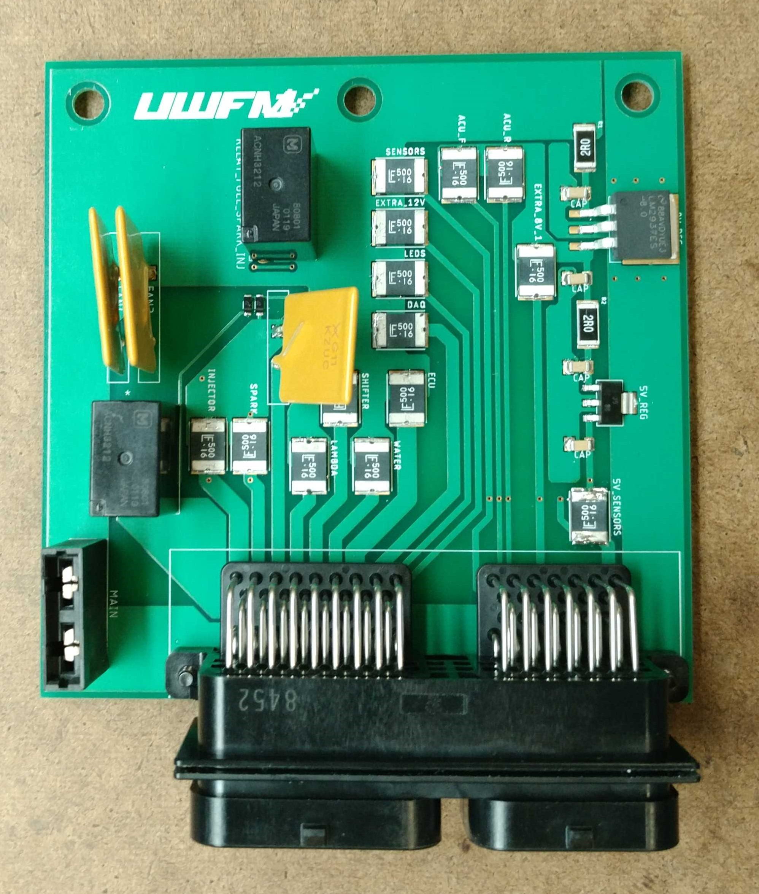
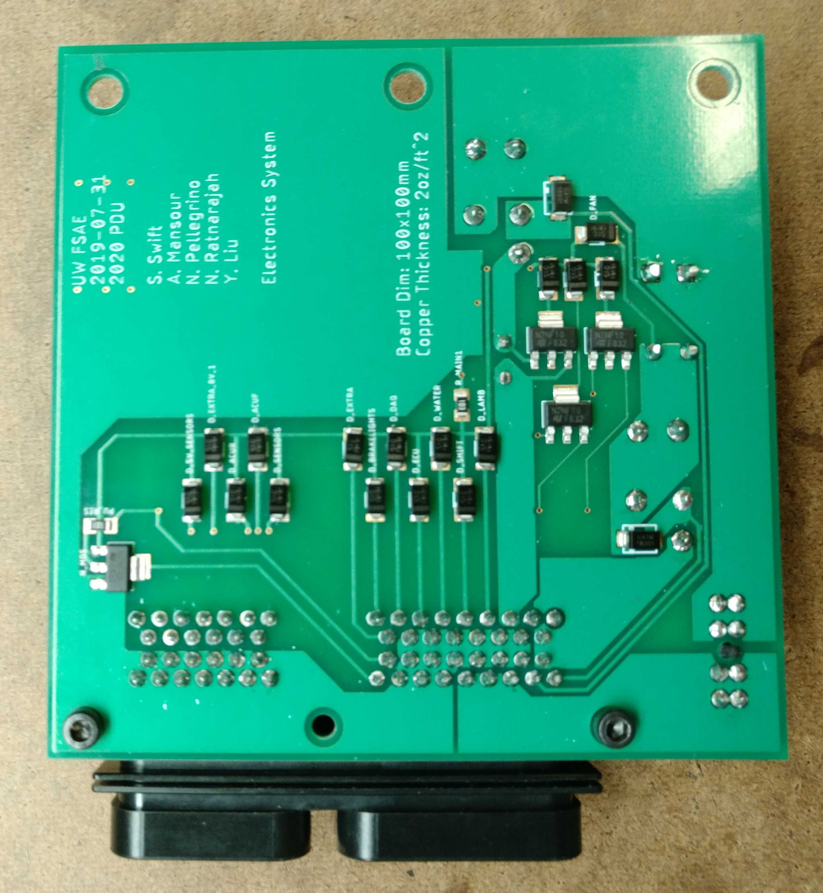
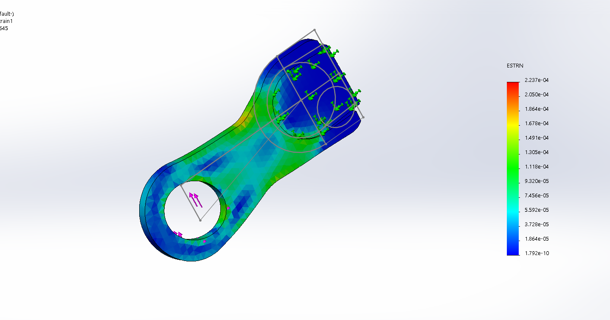

A long long time ago, even before the time of covid (it was 2019), I participated in 
my University's formula motorsports team. Although my interests have shifted drastically
and I no longer really have an interest in motorsports or automobiles, I am still proud of
what we accomplished and wanted to document it here.

My main contribution was the design and fabrication of the power distribution unit (pdu).
This board was responsible for taking 13v input from our car battery and stepping it down to
12v, 8v, and 5v rails, and distributing it to the necessary components on the car. As well
this board contained fuses and a telemetry line to our DAQ to indicate that a fuse had been tripped.

Unfortunately I'm fairly certain these never actually ran on the car since covid cancelled the following
competition season, and thats when I stopped being a team member.

I also designed some mechanical pieces, but honestly I had no idea what I was doing and when it came
time to manufacture these pieces, they were extremely difficult to manufacture.

A bracket intended to hold a pressurized gas tank used for the pnuematic shift system.

An arm that attaches to the clutch lever of our transmission.
